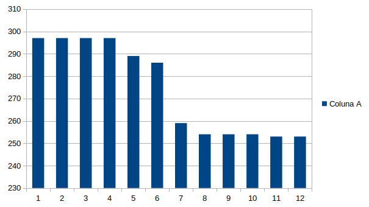
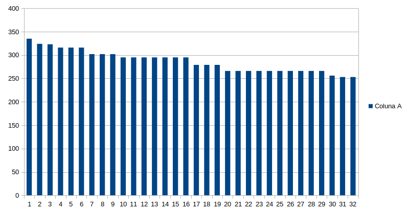

# Busca Tabu
#### Problema do Caixeiro Viajante
#### William D. Costa - RA 89239


### Conceito do Problema
O problema do caixeiro viajante (PCV) pode ser definido com uma questão: Dado uma lista de cidades e distâncias entre cada uma delas, qual é o menor caminho possível para percorrer todas as cidades, retornando à cidade de origem.

É um problema NP-difícil muito comum nos estudos de otimização combinatória

### Conceito da Solução

A busca tabu é uma meta heurística que visa a exploração dentro de um espaço de busca. A partir de uma solução inicial, são gerados vizinhos como possíveis soluções melhores, que são avaliados e iterados até que se satisfaça um critério de parada.

Para este exemplo, foram definidas uma série de cidades que distam umas das outras de acordo com os valores de uma matriz. A distância do caminho percorrido é calculada pela soma dos valores nos índices de intersecção da matriz.

Além da matriz de cidades, os outros parâmetros do algoritmo são:
* BTmax
    Este parâmetro corresponde ao critério de parada da busca. É o número máximo de iterações que o algoritmo deve executar sem encontrar uma solução melhor que a já encontrada
* T
  Tamanho da lista tabu, que é o array que armazena as soluções proibidas, a fim de evitar ciclos.

No exemplo implementado, foi utilizado como entrada a matriz de cidades anteriormente citado, bem como a solução gulosa apresentada em sala de aula, logo a chamada da função requer apenas dois parâmetros:

``` python
#5 iterações e lista tabu com 5 elementos
tabooSearch(cities, BTmax=5, T=5)
```

Considerando a solução inicial, teremos sempre uma "melhor solução" no espaço de busca, a partir dela o algoritmo gera uma sequência de vizinhos trocando elementos dois a dois.

Estes vizinhos (neighborhood) são avaliados a fim de encontrar uma solução melhor que a solução ótima até o momento (melhor solução).
Se dentre os vizinhos for encontrado uma solução melhor que a atual, este passa a ser a melhor solução e o contador de iterações é resetado.
Caso não haja nenhuma solução melhor, o algoritmo escolhe o melhor vizinho mesmo que este não seja uma solução ótima a fim de fugir de ótimos locais.
Dessa forma o algoritmo é capaz de explorar o espaço de busca avançando para soluções que não são mais eficientes que as já encontradas.

Isso se repete até que a quantidade de iterações sem que uma solução melhor que a "melhor solução" seja igual ao limite do parâmetro.
Quando isso acontece, a melhor solução é retornada, podendo ser a solução ótima global.
Por se tratar de uma metaheurística visando resolver problemas np-difícil, este algoritmo entrega a melhor solução de acordo com o tempo e condições de processamento.

### Análise dos Resultados

Dada como inicial a solução gulosa, vemos que encontramos a solução ótima (previamente conhecida) em 12 iterações, como podemos ver abaixo
```
the starter solution is:  [0, 8, 7, 2, 10, 1, 4, 3, 5, 9, 6, 0]
Avaliation of starter solution:  299
[8, 0, 7, 2, 10, 1, 4, 3, 5, 9, 6, 8] 297
[0, 7, 2, 10, 1, 4, 3, 5, 9, 6, 8, 0] 297
[7, 2, 10, 1, 4, 3, 5, 9, 6, 8, 0, 7] 297
[2, 10, 1, 4, 3, 5, 9, 6, 8, 0, 7, 2] 297
[10, 1, 2, 4, 3, 5, 9, 6, 8, 0, 7, 10] 289
[1, 2, 4, 3, 5, 9, 6, 10, 8, 0, 7, 1] 286
[2, 4, 3, 5, 9, 6, 1, 10, 8, 0, 7, 2] 259
[4, 3, 5, 9, 2, 6, 1, 10, 8, 0, 7, 4] 254
[3, 5, 9, 2, 6, 1, 10, 8, 0, 7, 4, 3] 254
[5, 9, 2, 6, 1, 10, 8, 0, 7, 4, 3, 5] 254
[9, 5, 2, 6, 1, 10, 8, 0, 7, 4, 3, 9] 253
[5, 2, 6, 1, 10, 8, 0, 7, 4, 3, 9, 5] 253
Melhor Solução:  [9, 5, 2, 6, 1, 10, 8, 0, 7, 4, 3, 9]
Avaliação da melhor solução:  253
```
Já com uma solução inicial qualquer, precisamos de 33 iterações para chegar no mesmo resultado:

```
the starter solution is:  [0, 1, 2, 3, 4, 5, 6, 7, 8, 9, 10, 0]
Avaliation of starter solution:  370
[1, 2, 3, 4, 5, 6, 7, 8, 0, 9, 10, 1] 335
[2, 3, 4, 5, 6, 1, 7, 8, 0, 9, 10, 2] 324
[3, 4, 5, 6, 1, 7, 8, 0, 9, 2, 10, 3] 323
[4, 3, 5, 6, 1, 7, 8, 0, 9, 2, 10, 4] 316
[3, 5, 6, 1, 7, 8, 0, 4, 9, 2, 10, 3] 316
[5, 6, 1, 7, 8, 0, 4, 9, 2, 10, 3, 5] 316
[6, 1, 7, 8, 0, 4, 9, 5, 2, 10, 3, 6] 302
[1, 7, 8, 0, 4, 9, 5, 2, 10, 3, 6, 1] 302
[7, 8, 0, 4, 9, 5, 2, 10, 3, 6, 1, 7] 302
[8, 0, 4, 9, 5, 2, 10, 7, 3, 6, 1, 8] 295
[0, 4, 9, 5, 2, 10, 7, 3, 6, 1, 8, 0] 295
[4, 9, 5, 2, 10, 7, 3, 6, 1, 8, 0, 4] 295
[9, 5, 2, 10, 7, 4, 3, 6, 1, 8, 0, 9] 295
[5, 2, 10, 7, 4, 3, 6, 1, 8, 0, 9, 5] 295
[2, 10, 7, 4, 3, 6, 1, 8, 0, 9, 5, 2] 295
[10, 7, 4, 3, 6, 1, 8, 0, 9, 5, 2, 10] 295
[7, 4, 3, 6, 1, 10, 8, 0, 9, 5, 2, 7] 279
[4, 3, 6, 1, 10, 8, 0, 9, 5, 2, 7, 4] 279
[3, 6, 1, 10, 8, 0, 4, 9, 5, 2, 7, 3] 279
[6, 1, 10, 8, 0, 4, 3, 9, 5, 2, 7, 6] 266
[1, 10, 8, 0, 4, 3, 9, 5, 2, 7, 6, 1] 266
[10, 8, 0, 4, 3, 9, 5, 2, 7, 6, 1, 10] 266
[8, 0, 4, 3, 9, 5, 2, 7, 6, 1, 10, 8] 266
[0, 4, 3, 9, 5, 2, 7, 6, 1, 10, 8, 0] 266
[4, 3, 9, 5, 2, 7, 6, 1, 10, 8, 0, 4] 266
[3, 9, 5, 2, 7, 6, 1, 10, 8, 0, 4, 3] 266
[9, 5, 2, 7, 6, 1, 10, 8, 0, 4, 3, 9] 266
[5, 2, 7, 6, 1, 10, 8, 0, 4, 3, 9, 5] 266
[2, 7, 6, 1, 10, 8, 0, 4, 3, 9, 5, 2] 266
[7, 2, 6, 1, 10, 8, 0, 4, 3, 9, 5, 7] 256
[2, 6, 1, 10, 8, 0, 7, 4, 3, 9, 5, 2] 253
[6, 1, 10, 8, 0, 7, 4, 3, 9, 5, 2, 6] 253
Melhor Solução:  [2, 6, 1, 10, 8, 0, 7, 4, 3, 9, 5, 2]
Avaliação da melhor solução:  253
```

Observamos isso pois o método de geração de vizinhos se torna pouco eficiente de acordo com a solução inicial. A modelagem deste método deve estar diretamente relacionada a natureza da solução inicial a ser recebida.

### Conclusão

Graças a solução inicial combinada com uma instância de problema pequena, conseguimos facilmente obter o ótimo global. A busca gerou e explorou os vizinhos eficientemente, criando uma progressão decrescente de soluções, conforme pode ser observado na figura:


Mesmo quando a solução inicial foi inserida descriteriosamente, observamos uma geração de soluções bastante eficiente



### Apêndice
```python
from random import randint
from math import floor
# Matriz quadrada com 11 cidades e as distâncias entre elas
cities = [
#      0   1   2   3   4   5    6   7    8   9  10
    [  0, 29, 20, 21, 16, 31, 100, 12,   4, 31, 18], # 0
    [ 29,  0, 15, 29, 28, 40,  72, 21,  29, 41, 12], # 1
    [ 20, 15,  0, 15, 14, 25,  81,  9,  23, 27, 13], # 2
    [ 21, 29, 15,  0,  4, 12,  92, 12,  25, 13, 25], # 3
    [ 16, 28, 14,  4,  0, 16,  94,  9,  20, 16, 22], # 4
    [ 31, 40, 25, 12, 16,  0,  95, 24,  36,  3, 37], # 5
    [100, 72, 81, 92, 94, 95,   0, 90, 101, 99, 84], # 6
    [ 12, 21,  9, 12,  9, 24,  90,  0,  15, 25, 13], # 7
    [  4, 29, 23, 25, 20, 36, 101, 15,   0, 35, 18], # 8
    [ 31, 41, 27, 13, 16,  3,  99, 25,  35,  0, 38], # 9
    [ 18, 12, 13, 25, 22, 37,  84, 13,  18, 38, 0]   # 10
]

evaluationsList = []
# Algoritmo guloso usando o vizinho mais próximo
# Generate the inicial solution for tabooSearch
def starterSolution(cities, initial=0):
    # Inicializa a rota com a cidade inicial e a distancia total com zero
    current = initial
    route = [current]
    total_distance = 0

    # Repita para o número de cidades - 1
    # A primeira cidade já foi adicionada na rota
    for _ in range(len(cities) - 1):

        # Pega a linha da matriz que representa os vizinhos da cidade atual (current)
        neighbours = cities[current]

        # Inicializa a menor distância com infinito
        best_neighbour = None
        best_distance = float("inf")

        # Para cada cidade vizinha da cidade corrente
        for idx in range(len(neighbours)):

            # Pega a distância da cidade atual para a cidade vizinha
            distance = neighbours[idx]

            # Se a cidade ainda não foi visitada e
            #  sua distância for maior que zero e
            #  sua distância for menor que a menor distância até o momento
            # então atualiza a cidade mais próxima da atual
            if idx not in route and distance > 0 and distance < best_distance:
                best_neighbour = idx
                best_distance = distance

        # Atualiza a cidade atual para o vizinho mais próxima
        # Adiciona o vizinho na rota e incrementa a distância total
        current = best_neighbour
        route.append(current)

    # Ao final, conectar a última cidade na primeira cidade
    route.append(initial)

    return (route)


teste = starterSolution(cities)


##### Métodos relacionados a busca tabu #####
# Valida a distância percorrida na rota recebida como parametro
def evaluate(solution):
    cityIndex = cities[solution[0]]
    distanceSolution = 0

    for city in solution:
        distanceSolution += cityIndex[city]
        cityIndex = cities[city]
    return distanceSolution


# inverte a posição do elemento index no array, com o proximo elemento (index + 1)
def invertTwoConsec(index, array):
    #verifica se é o último elemento da lista
    if len(array) == index + 1:
        #caso seja, troca o ultimo elemento com o primeiro
        aux = array[0]
        array[0] = array[index]
        array[index] = aux
    else:
        #se não for, troca o elemento na posição index com o próximo
        aux = array[index]
        array[index] = array[index + 1]
        array[index + 1] = aux

    return array


# Gera a vizinhança da solução atual, invertendo a posição de duas cidades consecutivas
def generateNeighboor(solution):
    neighborhood = []
    # para facilitar a manipulação do array, remove o ultimo elemento (cidade de retorno)
    rawsol = solution[:-1]

    for i in range(len(rawsol)):
        # recebe um array com os elementos na posição i invertidos
        invertedElement = invertTwoConsec(i, rawsol)
        #concatena o array com o elemento invertido com a cidade de retorno (primeira cidade)
        invertedElement = invertedElement + invertedElement[:1]
        neighborhood.append(invertedElement)
    return neighborhood

def getBestNeigh(neighborhood, tabooList, bestSol):

    toReturn = []
    aux = float("inf")

    for neighbor in neighborhood:
        if neighbor in tabooList:
            if evaluate(neighbor) < evaluate(bestSol):
                toReturn = neighbor
        else:
            aux2 = evaluate(neighbor)
            #variáveis extras criadas somente para fins de debug
            if evaluate(neighbor) < aux:
                aux = aux2
                toReturn = neighbor
    return toReturn


    print('erro: any neighbor was selected')


def tabooSearch(cities, BTmax, T):
    tabooList = []
    iter, bestIter = 0, 0
    # starterSol = starterSolution(cities)
    starterSol = [0, 1, 2, 3, 4, 5, 6, 7, 8, 9, 10, 0]
    bestSol = starterSol[:]

    print('the starter solution is: ', starterSol)
    print('Avaliation of starter solution: ', evaluate(starterSol))

    while (iter - bestIter) <= BTmax:

        neighborhood = generateNeighboor(starterSol)

        bestNeighbor = getBestNeigh(neighborhood, tabooList, bestSol)
        evaluation = evaluate(bestNeighbor)
        print(bestNeighbor, evaluation)
        evaluationsList.append(evaluation)
        #variavel para debug
        posTaboo = bestNeighbor
        starterSol = bestNeighbor[:]

        if len(tabooList) < T:
            tabooList.append(posTaboo)
        else:
            tabooList.pop(0)
            tabooList.append(posTaboo)

        if evaluate(bestNeighbor) < evaluate(bestSol):
            bestSol = bestNeighbor[:]
            bestIter += 1
        iter += 1

    return bestSol


if __name__ == '__main__':
    bestSol = tabooSearch(cities, BTmax=21, T=5)
    print('\nMelhor Solução: ', bestSol)
    print('Avaliação da melhor solução: ', evaluate(bestSol))


    with open('trab.txt', 'w') as f:
        for value in evaluationsList:
            valueStr = str(value) + "\n"
            f.write(str(valueStr))


```